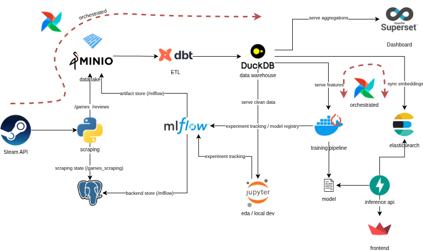

# End-to-end Recommender System Project: Steam Games Recommender

## Project Overview
This project serves as an end to end recommender system for Steam Games, with the following key features:
1. Data Collection (Via Steam API and other sources)
2. Data Preprocessing (ETL process using dbt and orchestration using Airflow)
3. Model Training (In an orchestrated pipeline leveraging experiment tracking and model registry capabilities)
4. Model Serving (Real Time inference throug a user interface)
5. Data Visualization (Via Apache Superset)

## Local Setup (Docker Compose) Architecture
